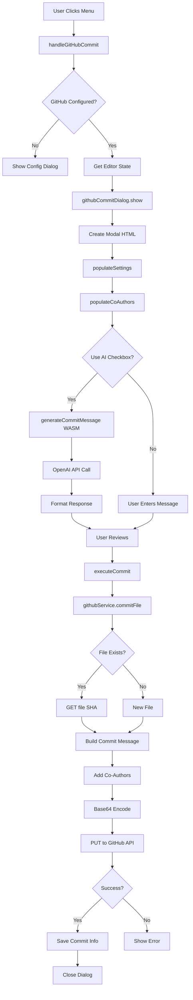
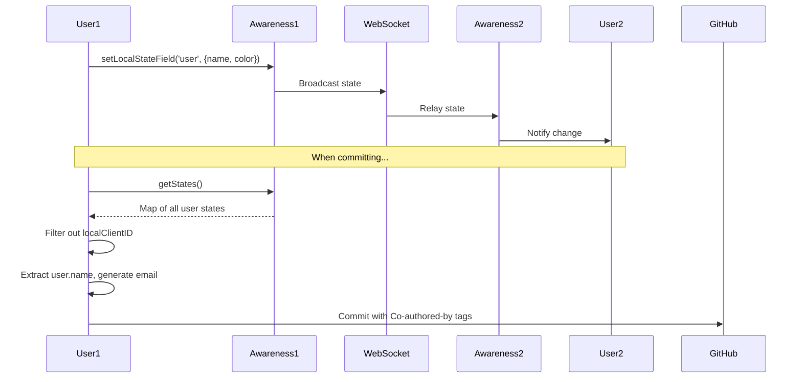

# GitHub Commit Flow Documentation

Complete function-by-function trace from menu click to GitHub commit.

## Table of Contents

1. [Overview](#overview)
2. [Architecture Diagram](#architecture-diagram)
3. [Detailed Flow](#detailed-flow)
4. [Function Reference](#function-reference)
5. [Error Handling](#error-handling)
6. [Co-Author Detection](#co-author-detection)

## Overview

The GitHub commit feature allows users to commit their collaborative document directly to GitHub with automatic co-author detection. The flow involves:

- Menu system triggering
- Dialog presentation with settings
- Optional AI commit message generation via Go WASM
- Co-author detection via Yjs awareness
- GitHub API communication

**Key Components:**
- Frontend: CodeMirror 6 + Yjs for collaboration
- WASM: Go module for AI commit messages
- GitHub: Direct API integration (no backend)

## Architecture Diagram



## Detailed Flow

### Phase 1: Menu Click to Dialog Display

#### 1.1 User Clicks "File → Commit to GitHub"

**File:** `index.html` (lines 61-72, 404-411)

The menu system detects clicks on dropdown items with `data-action` attributes:

```javascript
// Menu item in HTML
<div class="dropdown-item" data-action="github-commit">
  Commit to GitHub <span class="keyboard-shortcut">Ctrl+Alt+G</span>
</div>
```

**File:** `src/github/githubMenuIntegration.js` (lines 91-96)

Event listener catches the click:

```javascript
commitItem.addEventListener('click', () => {
  // Close menu
  document.querySelectorAll('.dropdown-menu').forEach(menu => {
    menu.classList.remove('show');
  });
  
  handleGitHubCommit();
});
```

#### 1.2 handleGitHubCommit() Function

**File:** `src/github/githubMenuIntegration.js` (lines 133-166)

```javascript
function handleGitHubCommit() {
  // Check if GitHub integration is configured
  if (!githubService.settings.token) {
    if (confirm('GitHub integration not configured. Configure now?')) {
      githubDialog.show();
    }
    return;
  }
  
  // Get the editor view and document content
  const view = window.editorView;
  if (!view) {
    alert('Editor not available. Please try again.');
    return;
  }
  
  // Get the Yjs text and awareness instances
  const ytext = window.ydoc ? window.ydoc.getText('codemirror') : null;
  let awareness = null;
  
  // Try different ways to access awareness
  if (window.awareness) {
    awareness = window.awareness;
  } else if (window.provider && window.provider.awareness) {
    awareness = window.provider.awareness;
  }
  
  // Get document content
  const content = view.state.doc.toString();
  
  // Show commit dialog with awareness explicitly passed
  githubCommitDialog.show(content, ytext, awareness);
}
```

**Global Variables Used:**
- `window.editorView` - Set in `src/setup/editorSetup.js` (line 68)
- `window.ydoc` - Set in `src/app.js` (line 202)
- `window.awareness` - Set in `src/app.js` (line 203)

### Phase 2: Dialog Display and Setup

#### 2.1 githubCommitDialog.show()

**File:** `src/ui/githubCommitDialog.js` (lines 15-34)

```javascript
show(content, ytext, awareness) {
  if (this.isOpen) return;
  
  this.isOpen = true;
  document.body.style.overflow = 'hidden';
  
  this.documentContent = content;
  this.ytext = ytext;
  this.awareness = awareness;
  
  // Create and show modal
  const modal = this.createModalHTML();
  document.body.appendChild(modal);
  
  // Populate with current settings
  this.populateSettings();
  
  // Setup event listeners
  this.setupEventListeners();
  
  // Populate co-authors
  this.populateCoAuthors();
  
  console.log('GitHub commit dialog opened');
}
```

#### 2.2 createModalHTML()

**File:** `src/ui/githubCommitDialog.js` (lines 47-133)

Creates the modal structure with:
- Repository selector (dropdown)
- File path input
- Commit message textarea
- "Use AI" checkbox
- Co-authors list
- Status message area
- Action buttons

```javascript
createModalHTML() {
  const modal = document.createElement('div');
  modal.id = 'github-commit-modal';
  modal.className = 'modal-overlay show';
  modal.setAttribute('role', 'dialog');
  modal.setAttribute('aria-labelledby', 'commit-title');
  
  modal.innerHTML = `
    <div class="modal-dialog github-commit-dialog">
      <div class="modal-header">
        <h2 id="commit-title" class="modal-title">Commit to GitHub</h2>
        <button class="modal-close" type="button" id="commit-close">&times;</button>
      </div>
      <div class="modal-content">
        <!-- Repository section -->
        <!-- Commit details section -->
        <!-- Co-authors section -->
      </div>
      <div class="modal-footer">
        <button id="configure-github">Configure GitHub</button>
        <button id="execute-commit">Commit to GitHub</button>
        <button id="cancel-commit">Cancel</button>
      </div>
    </div>
  `;
  
  return modal;
}
```

#### 2.3 populateSettings()

**File:** `src/ui/githubCommitDialog.js` (lines 138-197)

Fills the dialog with saved settings:

```javascript
populateSettings() {
  const settings = githubService.settings;
  
  const repoSelect = document.getElementById('commit-repo');
  const pathInput = document.getElementById('commit-path');
  const messageInput = document.getElementById('commit-message');
  const aiCheckbox = document.getElementById('use-ai-message');
  
  // Check if configured
  if (!settings.enabled || !settings.token) {
    this.setStatus('warning', 'GitHub integration not configured.');
  }
  
  // Disable AI checkbox if no Grokker API key
  if (!settings.grokkerApiKey) {
    if (aiCheckbox) {
      aiCheckbox.disabled = true;
      // Show warning
    }
  }
  
  // Populate repository dropdown
  if (repoSelect && settings.repos) {
    settings.repos.forEach(repo => {
      const option = document.createElement('option');
      option.value = repo.fullName;
      option.textContent = repo.fullName;
      repoSelect.appendChild(option);
    });
    
    if (settings.selectedRepo) {
      repoSelect.value = settings.selectedRepo;
    }
  }
  
  // Set default file path
  const titleInput = document.getElementById('document-title');
  let defaultFilename = 'document.md';
  if (titleInput && titleInput.value) {
    defaultFilename = `${titleInput.value.trim()
      .replace(/\s+/g, '-').toLowerCase()}.md`;
  }
  
  if (pathInput) {
    pathInput.value = settings.defaultPath || defaultFilename;
  }
  
  // Set default commit message
  if (messageInput) {
    messageInput.value = settings.commitMessage || 
                         'Update from collaborative editor';
  }
}
```

### Phase 3: Co-Author Detection

#### 3.1 populateCoAuthors()

**File:** `src/ui/githubCommitDialog.js` (lines 273-352)

Detects collaborators via Yjs awareness:

```javascript
populateCoAuthors() {
  const coAuthorsList = document.getElementById('co-authors-list');
  if (!coAuthorsList) return;
  
  // Clear existing list
  coAuthorsList.innerHTML = '';
  
  // Check if awareness is available
  if (!this.awareness) {
    console.warn('Awareness not available');
    coAuthorsList.innerHTML = 
      '<div class="co-author-placeholder">No awareness available</div>';
    return;
  }
  
  try {
    // Get local client ID
    const localClientID = this.awareness.clientID;
    console.log(`Local client ID: ${localClientID}`);
    
    // Get all users from awareness
    const states = this.awareness.getStates();
    console.log(`Found ${states.size} total users in room`);
    
    // Log all users for debugging
    states.forEach((state, id) => {
      console.log(`User ID ${id}:`, state.user);
    });
    
    // Get all clients except local user
    const clients = Array.from(states.entries())
      .filter(([id]) => id !== localClientID);
    
    console.log(`After filtering, found ${clients.length} other clients`);
    
    // Filter out clients without user data
    const collaborators = clients
      .map(([id, state]) => state.user)
      .filter(user => user && user.name);
    
    console.log(`Found ${collaborators.length} collaborators with names`);
    
    if (collaborators.length === 0) {
      coAuthorsList.innerHTML = 
        '<div class="co-author-placeholder">No other collaborators</div>';
      return;
    }
    
    // Add each collaborator to the list
    collaborators.forEach(user => {
      const coAuthorElement = document.createElement('div');
      coAuthorElement.className = 'co-author-item';
      
      const colorDot = document.createElement('span');
      colorDot.className = 'co-author-color';
      colorDot.style.backgroundColor = user.color || '#ccc';
      
      const nameSpan = document.createElement('span');
      nameSpan.className = 'co-author-name';
      nameSpan.textContent = user.name;
      
      const emailSpan = document.createElement('span');
      emailSpan.className = 'co-author-email';
      emailSpan.textContent = 
        `${user.name.toLowerCase().replace(/[^a-z0-9]/g, '')}@example.com`;
      
      coAuthorElement.appendChild(colorDot);
      coAuthorElement.appendChild(nameSpan);
      coAuthorElement.appendChild(emailSpan);
      
      coAuthorsList.appendChild(coAuthorElement);
    });
  } catch (error) {
    console.error('Error populating co-authors:', error);
    coAuthorsList.innerHTML = 
      '<div class="co-author-placeholder">Error detecting collaborators</div>';
  }
}
```

**How Awareness Works:**

1. **Setup** (`src/setup/yjsSetup.js`, line 27):
   ```javascript
   const awareness = provider.awareness;
   ```

2. **User Data Set** (`src/setup/userSetup.js`, lines 28-30):
   ```javascript
   awareness.setLocalStateField('user', { name, color });
   ```

3. **Access States**:
   ```javascript
   const states = awareness.getStates(); // Map of clientID -> state
   const localID = awareness.clientID;   // Local client's ID
   ```

### Phase 4: Optional AI Commit Message

#### 4.1 handleAIMessageCheckbox()

**File:** `src/ui/githubCommitDialog.js` (lines 260-271)

```javascript
handleAIMessageCheckbox() {
  const checkbox = document.getElementById('use-ai-message');
  if (!checkbox) return;
  
  // Save preference
  githubService.settings.useAICommitMessage = checkbox.checked;
  githubService.saveSettings();
  
  // Generate if checked
  if (checkbox.checked) {
    if (!githubService.settings.grokkerApiKey) {
      // Show error
      return;
    }
    
    this.generateCommitMessage();
  }
}
```

#### 4.2 generateCommitMessage()

**File:** `src/ui/githubCommitDialog.js` (lines 276-393)

```javascript
async generateCommitMessage() {
  if (this.grokkerGenerating) return;
  
  const messageInput = document.getElementById('commit-message');
  const pathInput = document.getElementById('commit-path');
  const aiStatusEl = document.getElementById('ai-status');
  
  if (!messageInput || !pathInput) return;
  
  // Check API key
  if (!githubService.settings.grokkerApiKey) {
    if (aiStatusEl) {
      aiStatusEl.className = 'status-message status-error';
      aiStatusEl.textContent = 'Grokker API key not configured';
    }
    return;
  }
  
  this.grokkerGenerating = true;
  
  if (aiStatusEl) {
    aiStatusEl.className = 'status-message status-loading';
    aiStatusEl.textContent = 'Generating commit message with Grokker...';
  }
  
  this.setLoading(true);
  
  try {
    const filePath = pathInput.value.trim() || 'document.md';
    
    console.log("GROKKER INTEGRATION DEBUG:");
    console.log("API Key configured:", !!githubService.settings.grokkerApiKey);
    console.log("Document content length:", this.documentContent.length);
    console.log("File path:", filePath);
    console.log("WASM function available:", 
                typeof window.generateCommitMessage);
    
    // Try WASM first
    if (typeof window.generateCommitMessage === 'function') {
      try {
        console.log("Using WASM commit message generator");
        
        const result = await window.generateCommitMessage({
          content: this.documentContent,
          apiKey: githubService.settings.grokkerApiKey,
          model: "grokker"
        });
        
        console.log("WASM generation result:", result);
        
        // Update message input
        messageInput.value = result.fullMessage;
        
        if (aiStatusEl) {
          aiStatusEl.className = 'status-message status-success';
          aiStatusEl.textContent = 
            'Commit message generated successfully with Grokker WASM!';
        }
        return;
      } catch (wasmError) {
        console.error("WASM commit generation failed:", wasmError);
        // Fall through to fallback
      }
    }
    
    // Fallback: Generate basic message
    const fileExt = filePath.split('.').pop().toLowerCase();
    let commitType = 'update';
    
    switch (fileExt) {
      case 'md':
      case 'markdown':
        commitType = 'docs';
        break;
      case 'js':
      case 'ts':
        commitType = 'feat';
        break;
    }
    
    const title = `${commitType}: update ${filePath.split('/').pop()}`;
    const body = `- Updated content in ${fileName}\n` +
                 `- Improved formatting\n` +
                 `- Added new information`;
    
    messageInput.value = `${title}\n\n${body}`;
    
    if (aiStatusEl) {
      aiStatusEl.className = 'status-message status-warning';
      aiStatusEl.textContent = 
        'Grokker failed - generated fallback message';
    }
    
  } catch (error) {
    console.error('Failed to generate commit message:', error);
    
    if (aiStatusEl) {
      aiStatusEl.className = 'status-message status-error';
      aiStatusEl.textContent = `Failed: ${error.message}`;
    }
  } finally {
    this.grokkerGenerating = false;
    this.setLoading(false);
  }
}
```

#### 4.3 WASM Function Call

**File:** `v3/wasm/main.go` (lines 24-61)

The WASM function is called from JavaScript:

```javascript
// JavaScript calls this
const result = await window.generateCommitMessage({
  content: documentContent,
  apiKey: apiKey,
  model: "grokker"
});
```

**Go WASM Implementation:**

```go
// generateCommitMessage creates a git commit message from file changes
func generateCommitMessage(this js.Value, args []js.Value) interface{} {
    if len(args) < 1 {
        errorObj := map[string]interface{}{
            "error": "No parameters provided",
            "code":  "INVALID_INPUT",
        }
        return mapToJSObject(errorObj)
    }

    params := args[0]

    // Create a Promise
    handler := js.FuncOf(func(this js.Value, promiseArgs []js.Value) interface{} {
        resolve := promiseArgs[0]
        reject := promiseArgs[1]

        go func() {
            content := getStringParam(params, "content")
            apiKey := getStringParam(params, "apiKey")
            model := getStringParam(params, "model")

            if err := validateInputs(content, apiKey, model); err != nil {
                rejectWithError(reject, "INVALID_INPUT", err.Error(), "")
                return
            }

            result, err := generateGitCommitMessage(content, apiKey, model)
            if err != nil {
                rejectWithError(reject, "API_ERROR", 
                               "Failed to generate", err.Error())
                return
            }

            resolve.Invoke(resultToJSObject(result))
        }()

        return nil
    })

    promiseConstructor := js.Global().Get("Promise")
    return promiseConstructor.New(handler)
}
```

**OpenAI API Call** (lines 70-157):

```go
func generateGitCommitMessage(content, apiKey, model string) (*CommitResult, error) {
    apiEndpoint := "https://api.openai.com/v1/chat/completions"

    requestBody := map[string]interface{}{
        "model": getModelName(model),
        "messages": []map[string]string{
            {
                "role": "system",
                "content": `You are an expert at generating git commit messages 
                           in the Conventional Commits format...`,
            },
            {
                "role":    "user",
                "content": fmt.Sprintf("Generate a commit message for: %s", 
                                      content),
            },
        },
        "temperature": 0.7,
        "max_tokens":  500,
    }

    jsonBody, _ := json.Marshal(requestBody)
    req, _ := http.NewRequest("POST", apiEndpoint, bytes.NewBuffer(jsonBody))
    req.Header.Set("Content-Type", "application/json")
    req.Header.Set("Authorization", fmt.Sprintf("Bearer %s", apiKey))

    client := &http.Client{Timeout: 30 * time.Second}
    resp, err := client.Do(req)
    if err != nil {
        return nil, err
    }
    defer resp.Body.Close()

    var response struct {
        Choices []struct {
            Message struct {
                Content string `json:"content"`
            } `json:"message"`
        } `json:"choices"`
    }

    json.NewDecoder(resp.Body).Decode(&response)

    commitMessage := response.Choices[0].Message.Content
    title, body := parseCommitMessage(commitMessage)

    return &CommitResult{
        Title:       title,
        Body:        body,
        FullMessage: commitMessage,
    }, nil
}
```

### Phase 5: Commit Execution

#### 5.1 executeCommit()

**File:** `src/ui/githubCommitDialog.js` (lines 357-420)

```javascript
async executeCommit() {
  const repoSelect = document.getElementById('commit-repo');
  const pathInput = document.getElementById('commit-path');
  const messageInput = document.getElementById('commit-message');
  
  // Validate inputs
  if (!repoSelect.value) {
    this.setStatus('error', 'Please select a repository');
    return;
  }
  
  if (!pathInput.value.trim()) {
    this.setStatus('error', 'Please enter a file path');
    return;
  }
  
  if (!messageInput.value.trim()) {
    this.setStatus('error', 'Please enter a commit message');
    return;
  }
  
  if (!githubService.settings.token) {
    this.setStatus('error', 'GitHub token not configured');
    return;
  }
  
  this.setLoading(true);
  this.setStatus('loading', 'Committing to GitHub...');
  
  try {
    // Get co-authors from UI
    const coAuthors = this.getCoAuthors();
    
    // Execute commit
    const result = await githubService.commitFile(
      this.documentContent,
      pathInput.value.trim(),
      messageInput.value.trim(),
      coAuthors
    );
    
    // Update settings
    githubService.settings.selectedRepo = repoSelect.value;
    githubService.settings.defaultPath = pathInput.value.trim();
    githubService.settings.commitMessage = messageInput.value.trim();
    githubService.saveSettings();
    
    this.setStatus('success', 'Successfully committed to GitHub!');
    
    // Show link to GitHub
    if (result && result.commit && result.commit.html_url) {
      const statusEl = document.getElementById('commit-status');
      if (statusEl) {
        const viewLink = document.createElement('a');
        viewLink.href = result.commit.html_url;
        viewLink.target = '_blank';
        viewLink.textContent = 'View on GitHub';
        viewLink.className = 'github-link';
        
        statusEl.appendChild(document.createElement('br'));
        statusEl.appendChild(viewLink);
      }
    }
    
    // Close after delay
    setTimeout(() => {
      this.hide();
    }, 3000);
  } catch (error) {
    this.setStatus('error', `Commit failed: ${error.message}`);
  } finally {
    this.setLoading(false);
  }
}
```

#### 5.2 getCoAuthors()

**File:** `src/ui/githubCommitDialog.js` (lines 425-466)

```javascript
getCoAuthors() {
  if (!this.awareness) {
    console.warn('Awareness not available');
    return [];
  }
  
  const localClientID = this.awareness.clientID;
  
  const clients = Array.from(this.awareness.getStates().entries());
  console.log(`Found ${clients.length} total users (including self)`);
  
  const allUsers = clients.map(([id, state]) => {
    return {
      id,
      name: state.user?.name || 'Unknown',
      isLocal: id === localClientID
    };
  });
  console.log('All users in room:', allUsers);
  
  // Filter out local client
  const collaborators = clients
    .filter(([id]) => id !== localClientID)
    .map(([id, state]) => state.user)
    .filter(user => user && user.name);
  
  console.log(`Found ${collaborators.length} collaborators for co-authors`);
  
  // Create co-author objects
  return collaborators.map(user => {
    const email = user.name 
      ? `${user.name.toLowerCase().replace(/[^a-z0-9]/g, '')}@example.com`
      : 'user@example.com';
    
    return {
      name: user.name || 'Anonymous User',
      email: email
    };
  });
}
```

### Phase 6: GitHub API Communication

#### 6.1 githubService.commitFile()

**File:** `src/github/githubService.js` (lines 95-235)

```javascript
async commitFile(content, filePath, commitMessage, coAuthors = []) {
  if (!this.settings.token || !this.settings.selectedRepo) {
    throw new Error('GitHub settings not configured');
  }

  const selectedRepo = this.settings.repos.find(
    r => r.fullName === this.settings.selectedRepo
  );
  
  if (!selectedRepo) {
    throw new Error('Selected repository not found');
  }

  console.log(`Starting commit to ${this.settings.selectedRepo}`);
  console.log(`Path: ${filePath}`);
  console.log(`With ${coAuthors.length} co-authors`);
  
  try {
    // Step 1: Check if file exists
    let fileSha = null;
    let existingFile = false;
    
    try {
      console.log(`Checking if file exists: ${filePath}`);
      const fileResponse = await fetch(
        `https://api.github.com/repos/${this.settings.selectedRepo}/` +
        `contents/${filePath}`,
        {
          headers: {
            'Authorization': `token ${this.settings.token}`,
            'Accept': 'application/vnd.github.v3+json'
          }
        }
      );
      
      if (fileResponse.ok) {
        const fileData = await fileResponse.json();
        fileSha = fileData.sha;
        existingFile = true;
        console.log(`File exists with SHA: ${fileSha}`);
      }
    } catch (error) {
      console.log('File does not exist, will create new file');
      existingFile = false;
    }

    // Step 2: Build commit message with co-authors
    let fullCommitMessage = commitMessage.trim();
    
    if (coAuthors && coAuthors.length > 0) {
      fullCommitMessage += '\n\n';
      
      console.log('Adding co-authors to commit:');
      
      coAuthors.forEach(author => {
        const sanitizedName = author.name.replace(/[<>]/g, '').trim();
        let sanitizedEmail = author.email;
        
        if (!sanitizedEmail) {
          sanitizedEmail = 
            `${sanitizedName.toLowerCase().replace(/[^a-z0-9]/g, '')}` +
            `@example.com`;
        }
        
        sanitizedEmail = sanitizedEmail.replace(/[<>]/g, '').trim();
        
        fullCommitMessage += 
          `Co-authored-by: ${sanitizedName} <${sanitizedEmail}>\n`;
        console.log(`- ${sanitizedName} <${sanitizedEmail}>`);
      });
    }

    console.log('Preparing commit payload');
    
    // Step 3: Create payload
    const payload = {
      message: fullCommitMessage,
      content: btoa(unescape(encodeURIComponent(content))),
      branch: selectedRepo.defaultBranch
    };

    if (existingFile && fileSha) {
      payload.sha = fileSha;
      console.log(`Updating existing file with SHA: ${fileSha}`);
    } else {
      console.log('Creating new file');
    }

    console.log('Sending commit request to GitHub API');
    
    // Step 4: Make API request
    const commitResponse = await fetch(
      `https://api.github.com/repos/${this.settings.selectedRepo}/` +
      `contents/${filePath}`,
      {
        method: 'PUT',
        headers: {
          'Authorization': `token ${this.settings.token}`,
          'Accept': 'application/vnd.github.v3+json',
          'Content-Type': 'application/json'
        },
        body: JSON.stringify(payload)
      }
    );

    if (!commitResponse.ok) {
      const errorData = await commitResponse.json();
      console.error('GitHub API error:', errorData);
      throw new Error(`GitHub API error: ${errorData.message}`);
    }

    const result = await commitResponse.json();
    console.log('Commit successful:', result.commit.html_url);
    
    // Step 5: Save commit info
    this.settings.lastCommit = {
      sha: result.commit.sha,
      url: result.commit.html_url,
      date: new Date().toISOString(),
      path: filePath,
      repository: this.settings.selectedRepo
    };
    this.saveSettings();
    
    return result;
  } catch (error) {
    console.error('Failed to commit file:', error);
    throw new Error('Failed to commit to GitHub: ' + error.message);
  }
}
```

## Function Reference

### Menu Integration Functions

| Function | File | Line | Description |
|----------|------|------|-------------|
| `setupGitHubMenuItems()` | `githubMenuIntegration.js` | 12 | Initializes GitHub menu items |
| `addFileMenuItems()` | `githubMenuIntegration.js` | 20 | Adds items to File menu |
| `handleGitHubCommit()` | `githubMenuIntegration.js` | 133 | Handles commit menu click |
| `registerShortcuts()` | `githubMenuIntegration.js` | 56 | Registers Ctrl+Alt+G shortcut |

### Dialog Functions

| Function | File | Line | Description |
|----------|------|------|-------------|
| `show()` | `githubCommitDialog.js` | 15 | Shows commit dialog |
| `hide()` | `githubCommitDialog.js` | 36 | Closes commit dialog |
| `createModalHTML()` | `githubCommitDialog.js` | 50 | Creates modal structure |
| `populateSettings()` | `githubCommitDialog.js` | 138 | Fills form with settings |
| `populateCoAuthors()` | `githubCommitDialog.js` | 273 | Lists collaborators |
| `generateCommitMessage()` | `githubCommitDialog.js` | 276 | Generates AI message |
| `executeCommit()` | `githubCommitDialog.js` | 357 | Executes GitHub commit |
| `getCoAuthors()` | `githubCommitDialog.js` | 425 | Extracts co-author data |

### GitHub Service Functions

| Function | File | Line | Description |
|----------|------|------|-------------|
| `commitFile()` | `githubService.js` | 95 | Commits to GitHub API |
| `validateToken()` | `githubService.js` | 37 | Validates GitHub token |
| `fetchRepositories()` | `githubService.js` | 66 | Gets user repositories |
| `getFileContent()` | `githubService.js` | 236 | Retrieves file from GitHub |

### WASM Functions

| Function | File | Line | Description |
|----------|------|------|-------------|
| `generateCommitMessage()` | `v3/wasm/main.go` | 24 | WASM entry point |
| `generateGitCommitMessage()` | `v3/wasm/main.go` | 70 | Calls OpenAI API |
| `parseCommitMessage()` | `v3/wasm/main.go` | 199 | Parses title/body |

## Error Handling

### Common Error Scenarios

#### 1. GitHub Not Configured

**Location:** `githubMenuIntegration.js` (line 135)

```javascript
if (!githubService.settings.token) {
  if (confirm('GitHub integration not configured. Configure now?')) {
    githubDialog.show();
  }
  return;
}
```

#### 2. Editor Not Available

**Location:** `githubMenuIntegration.js` (line 143)

```javascript
const view = window.editorView;
if (!view) {
  alert('Editor not available. Please try again.');
  return;
}
```

#### 3. Awareness Not Available

**Location:** `githubCommitDialog.js` (line 280)

```javascript
if (!this.awareness) {
  console.warn('Awareness not available');
  coAuthorsList.innerHTML = 
    '<div class="co-author-placeholder">No awareness available</div>';
  return;
}
```

#### 4. WASM Generation Failed

**Location:** `githubCommitDialog.js` (line 330)

```javascript
try {
  const result = await window.generateCommitMessage({...});
} catch (wasmError) {
  console.error("WASM commit generation failed:", wasmError);
  // Fall through to fallback message generation
}
```

#### 5. GitHub API Error

**Location:** `githubService.js` (line 208)

```javascript
if (!commitResponse.ok) {
  const errorData = await commitResponse.json();
  console.error('GitHub API error:', errorData);
  throw new Error(`GitHub API error: ${errorData.message}`);
}
```

## Co-Author Detection

### Data Flow



### Co-Author Format

Git expects co-authors in this format:

```
feat: add new feature

Implemented XYZ functionality.

Co-authored-by: Alice Smith <alicesmith@example.com>
Co-authored-by: Bob Jones <bobjones@example.com>
```

**Implementation:**

```javascript
// Build message
let fullCommitMessage = commitMessage.trim();

if (coAuthors && coAuthors.length > 0) {
  fullCommitMessage += '\n\n';  // Blank line separator
  
  coAuthors.forEach(author => {
    fullCommitMessage += 
      `Co-authored-by: ${author.name} <${author.email}>\n`;
  });
}
```

### Email Generation

Since Yjs awareness only stores names and colors, emails are generated:

```javascript
const email = user.name 
  ? `${user.name.toLowerCase().replace(/[^a-z0-9]/g, '')}@example.com`
  : 'user@example.com';
```

**Example:**
- Name: "Alice Smith" → Email: "alicesmith@example.com"
- Name: "Bob-Jones" → Email: "bobjones@example.com"

## Performance Considerations

1. **WASM Loading** - Loaded once during app initialization
2. **Awareness Updates** - Real-time via WebSocket
3. **GitHub API** - Rate limited (5000/hour for authenticated)
4. **Base64 Encoding** - Happens client-side before upload
5. **OpenAI API** - 30 second timeout, optional feature

## Security Notes

1. **Token Storage** - GitHub token stored in localStorage (not secure for production)
2. **API Keys** - OpenAI API key also in localStorage
3. **CORS** - GitHub API supports CORS for direct calls
4. **Input Sanitization** - Names and emails sanitized before Git commit
5. **XSS Protection** - User input escaped in HTML rendering

## Testing Checklist

- [ ] Menu item appears and opens dialog
- [ ] Dialog shows repositories from settings
- [ ] Co-authors list populates from awareness
- [ ] AI generation works with valid API key
- [ ] AI generation fails gracefully without key
- [ ] Commit succeeds for new files
- [ ] Commit succeeds for existing files (updates)
- [ ] Co-authors appear in GitHub commit
- [ ] Error messages display for invalid inputs
- [ ] Success message and GitHub link shown

## Troubleshooting

### "Editor not available"
- Check `window.editorView` is set in `editorSetup.js`
- Verify editor initialization completed

### "No collaborators detected"
- Check WebSocket connection to Yjs server
- Verify awareness is working: `awareness.getStates()`
- Check other users have set names

### "WASM function not available"
- Check `initGrokkerWasm()` completed successfully
- Verify `window.generateCommitMessage` exists
- Check browser console for WASM load errors

### "GitHub API error"
- Verify token has `repo` scope
- Check rate limit: 5000 requests/hour
- Ensure repository exists and is accessible

## Related Documentation

- [WASM API Reference](./wasm-api-reference.md)
- [Yjs Awareness Documentation](https://docs.yjs.dev/api/about-awareness)
- [GitHub API: Contents](https://docs.github.com/en/rest/repos/contents)
- [Conventional Commits](https://www.conventionalcommits.org/)
