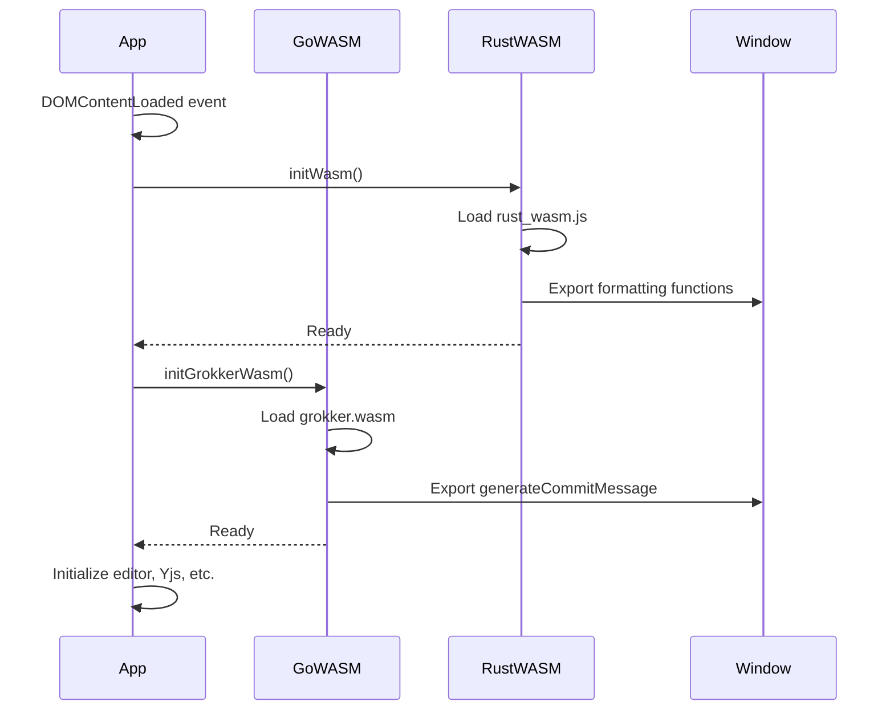

# WASM API Reference

Complete API documentation for all WebAssembly functions in the collaborative text editor.

## Table of Contents

1. [Overview](#overview)
2. [Go WASM Module](#go-wasm-module)
3. [Rust WASM Module](#rust-wasm-module)
4. [Integration Guide](#integration-guide)
5. [Error Handling](#error-handling)
6. [Performance](#performance)

## Overview

The editor uses two WASM modules:

1. **Go WASM** (`v3/wasm/main.go`) - AI commit message generation via OpenAI API
2. **Rust WASM** (`rust-wasm/`) - Text processing, formatting, and PromiseGrid protocol

### Module Loading

**File:** `src/app.js` (lines 14-40)

```javascript
// Load Go WASM
async function initGrokkerWasm() {
  const go = new Go();
  try {
    console.log("Loading Grokker WASM from dist/grokker.wasm");
    const result = await WebAssembly.instantiateStreaming(
      fetch('dist/grokker.wasm'),
      go.importObject
    );
    go.run(result.instance);
    console.log("Grokker WASM initialized");
    console.log("generateCommitMessage available:", 
                typeof window.generateCommitMessage);
  } catch (error) {
    console.error("Failed to load Grokker WASM:", error);
  }
}

// Load Rust WASM
async function initWasm() {
  await init(); // from rust_wasm.js
  
  // Test functions
  const output = export_to_markdown("**Hello world**");
  console.log("WASM Markdown Output:", output);
  
  // Test compression
  const testData = "Long text...".repeat(100);
  const compressed = compress_document(testData);
  console.log("Compressed size:", compressed.length);
}
```

### Global Exports

Both modules export functions to `window` object:

```javascript
// Go WASM exports
window.generateCommitMessage  // Promise-based function

// Rust WASM exports (from initWasm.js)
window.toggle_heading
window.toggle_list
window.toggle_bold
window.toggle_italic
window.toggle_underline
window.toggle_strikethrough
window.convert_url_to_markdown
window.createPromiseGridMessage
window.parsePromiseGridMessage
window.logPromiseGridMessage
window.searchDocument
```

## Go WASM Module

**Source:** `v3/wasm/main.go`
**Build:** `GOOS=js GOARCH=wasm go build -o dist/grokker.wasm`

### generateCommitMessage()

Generates a git commit message using OpenAI API.

#### Syntax

```javascript
const result = await window.generateCommitMessage(params);
```

#### Parameters

**params** (Object): Configuration object with the following properties:

| Property | Type | Required | Description |
|----------|------|----------|-------------|
| `content` | string | Yes | Document content to analyze |
| `apiKey` | string | Yes | OpenAI API key |
| `model` | string | No | Model name (default: "gpt-4") |

#### Return Value

Returns a **Promise** that resolves to a **CommitResult** object:

```typescript
interface CommitResult {
  title: string;       // First line of commit message
  body: string;        // Body text (bullet points)
  fullMessage: string; // Complete formatted message
}
```

#### Example Usage

```javascript
try {
  const result = await window.generateCommitMessage({
    content: "Added new feature for user authentication\n" +
             "- Implemented JWT tokens\n" +
             "- Added password hashing",
    apiKey: "sk-...",
    model: "gpt-4"
  });
  
  console.log("Title:", result.title);
  // "feat(auth): implement user authentication"
  
  console.log("Body:", result.body);
  // "- Added JWT token support\n- Implemented secure password hashing"
  
  console.log("Full Message:", result.fullMessage);
  // "feat(auth): implement user authentication\n\n
  //  - Added JWT token support\n- Implemented secure password hashing"
  
} catch (error) {
  console.error("Error:", error.error);
  console.error("Code:", error.code);
  console.error("Details:", error.details);
}
```

#### Error Codes

| Code | Description |
|------|-------------|
| `INVALID_INPUT` | Missing or invalid parameters |
| `API_ERROR` | OpenAI API request failed |
| `NETWORK_ERROR` | Network connectivity issue |
| `UNKNOWN_ERROR` | Unexpected error occurred |

#### Error Object Structure

```typescript
interface WASMError {
  error: string;    // Human-readable error message
  code: string;     // Error code from table above
  details: string;  // Additional error details
}
```

#### Implementation Details

**Go Code:** `v3/wasm/main.go` (lines 24-61)

```go
func generateCommitMessage(this js.Value, args []js.Value) interface{} {
    if len(args) < 1 {
        return mapToJSObject(map[string]interface{}{
            "error": "No parameters provided",
            "code":  "INVALID_INPUT",
        })
    }

    params := args[0]

    handler := js.FuncOf(func(this js.Value, promiseArgs []js.Value) interface{} {
        resolve := promiseArgs[0]
        reject := promiseArgs[1]

        go func() {
            content := getStringParam(params, "content")
            apiKey := getStringParam(params, "apiKey")
            model := getStringParam(params, "model")

            if err := validateInputs(content, apiKey, model); err != nil {
                rejectWithError(reject, "INVALID_INPUT", err.Error(), "")
                return
            }

            result, err := generateGitCommitMessage(content, apiKey, model)
            if err != nil {
                rejectWithError(reject, "API_ERROR", 
                               "Failed to generate", err.Error())
                return
            }

            resolve.Invoke(resultToJSObject(result))
        }()

        return nil
    })

    promiseConstructor := js.Global().Get("Promise")
    return promiseConstructor.New(handler)
}
```

**OpenAI Integration:** (lines 70-157)

```go
func generateGitCommitMessage(content, apiKey, model string) (*CommitResult, error) {
    apiEndpoint := "https://api.openai.com/v1/chat/completions"

    requestBody := map[string]interface{}{
        "model": getModelName(model),
        "messages": []map[string]string{
            {
                "role": "system",
                "content": `You are an expert at generating git commit messages 
                           in the Conventional Commits format.
                           Analyze the code changes and generate a concise, 
                           descriptive commit message.
                           First line: type(scope): brief description
                           Types: feat, fix, docs, style, refactor, perf, 
                                  test, build, ci, chore.
                           Body: bullet points explaining changes.`,
            },
            {
                "role":    "user",
                "content": fmt.Sprintf("Generate a commit message for: %s", 
                                      content),
            },
        },
        "temperature": 0.7,
        "max_tokens":  500,
    }

    jsonBody, err := json.Marshal(requestBody)
    if err != nil {
        return nil, fmt.Errorf("failed to marshal request: %w", err)
    }

    req, err := http.NewRequest("POST", apiEndpoint, 
                                bytes.NewBuffer(jsonBody))
    if err != nil {
        return nil, fmt.Errorf("failed to create request: %w", err)
    }

    req.Header.Set("Content-Type", "application/json")
    req.Header.Set("Authorization", fmt.Sprintf("Bearer %s", apiKey))

    client := &http.Client{Timeout: 30 * time.Second}
    resp, err := client.Do(req)
    if err != nil {
        return nil, fmt.Errorf("request failed: %w", err)
    }
    defer resp.Body.Close()

    if resp.StatusCode != http.StatusOK {
        var errorResponse map[string]interface{}
        json.NewDecoder(resp.Body).Decode(&errorResponse)
        return nil, fmt.Errorf("API error (status %d): %v", 
                              resp.StatusCode, errorResponse)
    }

    var response struct {
        Choices []struct {
            Message struct {
                Content string `json:"content"`
            } `json:"message"`
        } `json:"choices"`
    }

    if err := json.NewDecoder(resp.Body).Decode(&response); err != nil {
        return nil, fmt.Errorf("failed to decode response: %w", err)
    }

    if len(response.Choices) == 0 {
        return nil, fmt.Errorf("no response content")
    }

    commitMessage := response.Choices[0].Message.Content
    title, body := parseCommitMessage(commitMessage)

    return &CommitResult{
        Title:       title,
        Body:        body,
        FullMessage: commitMessage,
    }, nil
}
```

#### Model Names

The function accepts various model name aliases:

| Input | Actual Model Used |
|-------|------------------|
| `"grokker"` | `"gpt-4"` (default) |
| `"gpt-4"` | `"gpt-4"` |
| `"gpt-3.5"` | `"gpt-3.5-turbo"` |
| `"gpt3"` | `"gpt-3.5-turbo"` |
| `"4"` | `"gpt-4"` |
| `"3"` | `"gpt-3.5-turbo"` |

**Implementation:** (lines 161-184)

```go
func getModelName(model string) string {
    if model == "" || model == "grokker" {
        return "gpt-4"
    }

    modelMap := map[string]string{
        "gpt-3.5": "gpt-3.5-turbo",
        "gpt3":    "gpt-3.5-turbo",
        "gpt4":    "gpt-4",
        "4":       "gpt-4",
        "3":       "gpt-3.5-turbo",
    }

    if apiModel, ok := modelMap[strings.ToLower(model)]; ok {
        return apiModel
    }

    return model // Return as-is if not in map
}
```

#### Commit Message Format

The function generates messages following **Conventional Commits** format:

```
type(scope): brief description

- Bullet point 1 explaining change
- Bullet point 2 with more detail
- Bullet point 3 about implementation
```

**Types:**
- `feat` - New feature
- `fix` - Bug fix
- `docs` - Documentation changes
- `style` - Code style changes
- `refactor` - Code refactoring
- `perf` - Performance improvements
- `test` - Test additions/changes
- `build` - Build system changes
- `ci` - CI configuration changes
- `chore` - Other changes

## Rust WASM Module

**Source:** `rust-wasm/src/lib.rs`
**Build:** `wasm-pack build --target web --out-dir pkg`

### Text Processing Functions

#### export_to_markdown()

Converts text to markdown format.

```javascript
const markdown = export_to_markdown(text);
```

**Parameters:**
- `text` (string): Input text

**Returns:** (string) Markdown-formatted text

**Example:**
```javascript
const result = export_to_markdown("**Hello world**");
// Returns: "**Hello world**"
```

#### format_text()

Formats document text by:
- Removing excessive blank lines
- Fixing spacing around punctuation
- Normalizing whitespace
- Trimming lines

```javascript
const formatted = format_text(text);
```

**Parameters:**
- `text` (string): Text to format

**Returns:** (string) Formatted text

**Example:**
```javascript
const messy = "Hello   world.\n\n\n\nNext paragraph.";
const clean = format_text(messy);
// Returns: "Hello world.\n\nNext paragraph."
```

### Formatting Functions

#### toggle_bold()

Toggles bold markdown formatting.

```javascript
const result = toggle_bold(selectedText);
```

**Parameters:**
- `selectedText` (string): Text to format

**Returns:** (string) Text with bold toggled

**Examples:**
```javascript
toggle_bold("hello") 
// Returns: "**hello**"

toggle_bold("**hello**") 
// Returns: "hello"
```

**Used in:** `src/export/handlers.js` (line 99)

```javascript
const boldButton = document.querySelector('#bold-button');
if (boldButton) {
  boldButton.onclick = () => {
    handleToggleFormatting(view, toggle_bold, "Bold");
  };
}
```

#### toggle_italic()

Toggles italic markdown formatting.

```javascript
const result = toggle_italic(selectedText);
```

**Examples:**
```javascript
toggle_italic("hello") 
// Returns: "*hello*"

toggle_italic("*hello*") 
// Returns: "hello"
```

#### toggle_underline()

Toggles underline markdown formatting.

```javascript
const result = toggle_underline(selectedText);
```

**Examples:**
```javascript
toggle_underline("hello") 
// Returns: "__hello__"

toggle_underline("__hello__") 
// Returns: "hello"
```

#### toggle_strikethrough()

Toggles strikethrough markdown formatting.

```javascript
const result = toggle_strikethrough(selectedText);
```

**Examples:**
```javascript
toggle_strikethrough("hello") 
// Returns: "~~hello~~"

toggle_strikethrough("~~hello~~") 
// Returns: "hello"
```

#### toggle_heading()

Toggles heading markdown formatting at specified level.

```javascript
const result = toggle_heading(selectedText, level);
```

**Parameters:**
- `selectedText` (string): Text to format
- `level` (number): Heading level (1-3)

**Examples:**
```javascript
toggle_heading("Title", 1) 
// Returns: "# Title"

toggle_heading("# Title", 1) 
// Returns: "Title"

toggle_heading("Subtitle", 2) 
// Returns: "## Subtitle"
```

**Used in:** `src/export/handlers.js` (lines 147-169)

```javascript
const heading1Button = document.querySelector('#heading1-button');
if (heading1Button) {
  heading1Button.onclick = () => {
    handleToggleFormatting(view, 
      (text) => toggle_heading(text, 1), 
      "Heading 1"
    );
  };
}
```

#### toggle_list()

Toggles list markdown formatting.

```javascript
const result = toggle_list(selectedText, listType);
```

**Parameters:**
- `selectedText` (string): Text to format
- `listType` (string): `"bullet"` or `"numbered"`

**Examples:**
```javascript
toggle_list("Item", "bullet") 
// Returns: "- Item"

toggle_list("- Item", "bullet") 
// Returns: "Item"

toggle_list("Item", "numbered") 
// Returns: "1. Item"
```

#### convert_url_to_markdown()

Converts plain URLs in text to markdown links.

```javascript
const result = convert_url_to_markdown(text);
```

**Example:**
```javascript
const text = "Visit https://example.com for info";
const result = convert_url_to_markdown(text);
// Returns: "Visit [https://example.com](https://example.com) for info"
```

### Document Statistics

#### calculate_document_stats()

Calculates comprehensive document statistics.

```javascript
const statsJson = await calculate_document_stats(text);
const stats = JSON.parse(statsJson);
```

**Parameters:**
- `text` (string): Document text

**Returns:** (string) JSON string with statistics

**JSON Structure:**
```typescript
interface DocumentStats {
  words: number;               // Total word count
  chars_without_spaces: number;// Character count (excluding spaces)
  reading_time: number;        // Estimated reading time in minutes
}
```

**Example:**
```javascript
const text = "This is a sample document with multiple words.";
const statsJson = await calculate_document_stats(text);
const stats = JSON.parse(statsJson);

console.log(stats);
// {
//   words: 8,
//   chars_without_spaces: 38,
//   reading_time: 1
// }
```

**Used in:** `src/ui/documentStats.js` (lines 15-32)

```javascript
async function updateStats() {
  try {
    const text = ytext.toString();
    const statsJson = await calculate_document_stats(text);
    const stats = JSON.parse(statsJson);
    
    wordCountEl.textContent = `${stats.words} words`;
    charCountEl.textContent = `${stats.chars_without_spaces} chars`;
    readingTimeEl.textContent = `${stats.reading_time} min read`;
    
  } catch (error) {
    console.error('Failed to update document stats:', error);
  }
}
```

**Reading Time Calculation:**
- Based on average reading speed of 200 words per minute
- Rounds up to nearest minute

### Search Functions

#### search_document()

Searches document for query string and returns match positions.

```javascript
const resultsJson = search_document(content, query, caseSensitive);
const matches = JSON.parse(resultsJson);
```

**Parameters:**
- `content` (string): Document text to search
- `query` (string): Search query
- `caseSensitive` (boolean): Case-sensitive search

**Returns:** (string) JSON array of match objects

**Match Object:**
```typescript
interface SearchMatch {
  start: number;  // Start position of match
  end: number;    // End position of match
}
```

**Example:**
```javascript
const text = "The quick brown fox jumps over the lazy dog.";
const results = search_document(text, "the", false);
const matches = JSON.parse(results);

console.log(matches);
// [
//   { start: 0, end: 3 },    // "The"
//   { start: 31, end: 34 }   // "the"
// ]
```

**Used in:** `src/export/handlers.js` (lines 344-369)

```javascript
function handleSearch(view) {
  const searchInput = document.querySelector('#search-input');
  const query = searchInput.value.trim();
  
  if (!query) {
    console.log('No search query entered');
    return;
  }
  
  searchInput.disabled = true;
  
  setTimeout(() => {
    try {
      const content = view.state.doc.toString();
      const results = search_document(content, query, false);
      
      console.log('Search results:', results);
      
      const matches = JSON.parse(results);
      highlightMatches(view, matches);
      
    } catch (e) {
      console.error('Error parsing search results:', e);
      alert('Search error: ' + e.message);
    } finally {
      searchInput.disabled = false;
    }
  }, 10);
}
```

### Compression Functions

#### compress_document()

Compresses document text using LZ compression.

```javascript
const compressed = compress_document(text);
```

**Parameters:**
- `text` (string): Text to compress

**Returns:** (Uint8Array) Compressed data

**Example:**
```javascript
const longText = "This is a long document...".repeat(100);
const compressed = compress_document(longText);

console.log("Original size:", longText.length);
console.log("Compressed size:", compressed.length);
console.log("Compression ratio:", 
            ((longText.length - compressed.length) / longText.length * 100)
            .toFixed(1) + "%");
```

**Test Output:** `src/wasm/initWasm.js` (lines 20-28)

```
RUST WASM COMPRESSION TEST:
 Original size: 4700 bytes
 WASM compressed size: 142 bytes
 WASM compression ratio: 97.0%
 WASM decompression successful: true
```

#### decompress_document()

Decompresses document text.

```javascript
const original = decompress_document(compressed);
```

**Parameters:**
- `compressed` (Uint8Array): Compressed data

**Returns:** (string) Original text

**Example:**
```javascript
const compressed = compress_document("Hello world");
const decompressed = decompress_document(compressed);
console.log(decompressed); // "Hello world"
```

### PromiseGrid Functions

The PromiseGrid protocol functions handle CBOR-encoded messages for distributed collaboration.

#### create_promisegrid_edit_message()

Creates a PromiseGrid edit message in CBOR format.

```javascript
const cborBytes = create_promisegrid_edit_message(
  documentId,
  editType,
  position,
  content,
  userId
);
```

**Parameters:**
- `documentId` (string): Document identifier
- `editType` (string): Type of edit ("insert", "delete", "format", etc.)
- `position` (number): Position in document
- `content` (string): Edit content
- `userId` (string): User identifier

**Returns:** (Uint8Array) CBOR-encoded message

**Example:**
```javascript
const message = create_promisegrid_edit_message(
  "doc-123",
  "insert",
  0,
  "Hello PromiseGrid!",
  "user-456"
);

console.log("Message size:", message.length, "bytes");
```

**Used in:** `src/export/handlers.js` (lines 177-193)

```javascript
function sendEditAsPromiseGridMessage(editType, position, content, view) {
  try {
    const { documentId, userId } = getCurrentSessionInfo();
    
    const cborBytes = promiseGrid.createEditMessage(
      documentId,
      editType, 
      position,
      content,
      userId
    );
    
    promiseGrid.logMessage(cborBytes);
    
    console.log(`Created PromiseGrid message for ${editType} edit`);
    
    return cborBytes;
  } catch (error) {
    console.error('Failed to create PromiseGrid edit message:', error);
  }
}
```

#### create_promisegrid_stats_message()

Creates a PromiseGrid statistics message.

```javascript
const cborBytes = create_promisegrid_stats_message(
  documentId,
  stats,
  userId
);
```

**Parameters:**
- `documentId` (string): Document identifier
- `stats` (object): Statistics object
- `userId` (string): User identifier

**Returns:** (Uint8Array) CBOR-encoded message

#### parse_promisegrid_message()

Parses a PromiseGrid CBOR message.

```javascript
const parsedData = parse_promisegrid_message(cborBytes);
```

**Parameters:**
- `cborBytes` (Uint8Array): CBOR-encoded message

**Returns:** (object) Parsed message data

#### log_promisegrid_message()

Logs a PromiseGrid message to console in human-readable format.

```javascript
log_promisegrid_message(cborBytes);
```

**Parameters:**
- `cborBytes` (Uint8Array): CBOR-encoded message

**Returns:** void (logs to console)

**Example Output:**
```
PromiseGrid CBOR Message:
  Tag: 0x67726964 ('grid')
  Document: doc-123
  Edit Type: insert
  Position: 0
  Content: Hello PromiseGrid!
  User: user-456
  Size: 68 bytes
```

#### export_document_as_promisegrid()

Exports entire document as PromiseGrid CBOR message.

```javascript
const cborBytes = export_document_as_promisegrid(
  content,
  documentId,
  userId
);
```

**Parameters:**
- `content` (string): Full document content
- `documentId` (string): Document identifier
- `userId` (string): User identifier

**Returns:** (Uint8Array) CBOR-encoded document

**Used in:** `src/export/handlers.js` (lines 113-140)

```javascript
function handlePromiseGridExport(ydoc, ytext, view) {
  try {
    const content = ytext.toString();
    const { documentId, userId } = getCurrentSessionInfo();
    
    // Create PromiseGrid CBOR message
    const cborBytes = promiseGrid.exportDocument(
      content, 
      documentId, 
      userId
    );
    
    // Log to console
    promiseGrid.logMessage(cborBytes);
    
    // Create download
    const blob = new Blob([cborBytes], { type: 'application/cbor' });
    const filename = getPromiseGridFilename();
    downloadBlob(blob, filename);
    
    console.log('PromiseGrid CBOR export completed!');
    
  } catch (error) {
    console.error('PromiseGrid export failed:', error);
    alert('PromiseGrid export failed: ' + error.message);
  }
}
```

## Integration Guide

### Initialization Sequence



### Using WASM Functions in Code

#### Example 1: Bold Formatting

**File:** `src/export/handlers.js` (lines 92-133)

```javascript
async function handleToggleFormatting(view, toggleFunction, formatName) {
  try {
    const selection = view.state.selection.main;
    
    if (selection.empty) {
      console.log(`No text selected for ${formatName} formatting`);
      return;
    }

    const selectedText = view.state.doc.sliceString(
      selection.from, 
      selection.to
    );
    console.log(`WASM ${formatName.toUpperCase()} TOGGLE:`);
    console.log(`Selected: "${selectedText}"`);
    
    // Call WASM function
    const formattedText = await toggleFunction(selectedText);
    console.log(`Result: "${formattedText}"`);
    
    // Replace the selected text
    view.dispatch({
      changes: {
        from: selection.from,
        to: selection.to,
        insert: formattedText
      },
      selection: {
        anchor: selection.from,
        head: selection.from + formattedText.length
      }
    });
    
    console.log(`WASM ${formatName} formatting applied successfully`);

    // Send edit as PromiseGrid message
    sendEditAsPromiseGridMessage(
      formatName.toLowerCase(), 
      selection.from, 
      formattedText, 
      view
    );
    
  } catch (error) {
    console.error(`WASM ${formatName} formatting failed:`, error);
  }
}
```

#### Example 2: Document Statistics

**File:** `src/ui/documentStats.js` (lines 15-32)

```javascript
async function updateStats() {
  try {
    const text = ytext.toString();
    const statsJson = await calculate_document_stats(text);
    const stats = JSON.parse(statsJson);
    
    wordCountEl.textContent = `${stats.words} words`;
    charCountEl.textContent = `${stats.chars_without_spaces} chars`;
    readingTimeEl.textContent = `${stats.reading_time} min read`;
    
  } catch (error) {
    console.error('Failed to update document stats:', error);
  }
}

// Update on document changes
ytext.observe(updateStats);

// Initial calculation
updateStats();
```

#### Example 3: AI Commit Message

**File:** `src/ui/githubCommitDialog.js` (lines 320-345)

```javascript
// Check if WASM function is available
if (typeof window.generateCommitMessage === 'function') {
  try {
    console.log("Using WASM commit message generator");
    
    const result = await window.generateCommitMessage({
      content: this.documentContent,
      apiKey: githubService.settings.grokkerApiKey,
      model: "grokker"
    });
    
    console.log("WASM generation result:", result);
    
    // Update message input with generated message
    messageInput.value = result.fullMessage;
    
    if (aiStatusEl) {
      aiStatusEl.className = 'status-message status-success';
      aiStatusEl.textContent = 
        'Commit message generated successfully!';
    }
    return;
  } catch (wasmError) {
    console.error("WASM commit generation failed:", wasmError);
    // Fall through to fallback
  }
} else {
  console.warn("WASM generateCommitMessage not available");
}
```

### Error Handling Patterns

#### Pattern 1: Try-Catch with Fallback

```javascript
async function processText(text) {
  try {
    // Try WASM function
    const result = await wasmFunction(text);
    return result;
  } catch (error) {
    console.error("WASM function failed:", error);
    
    // Fallback to JavaScript implementation
    return javascriptFallback(text);
  }
}
```

#### Pattern 2: Availability Check

```javascript
if (typeof window.generateCommitMessage === 'function') {
  // WASM available, use it
  const result = await window.generateCommitMessage(params);
} else {
  // WASM not loaded, use alternative
  console.warn("WASM not available, using fallback");
  const result = fallbackFunction(params);
}
```

#### Pattern 3: Promise Rejection Handling

```javascript
window.generateCommitMessage(params)
  .then(result => {
    // Success
    console.log("Generated:", result.fullMessage);
  })
  .catch(error => {
    // Error from WASM
    console.error("Error code:", error.code);
    console.error("Error message:", error.error);
    console.error("Details:", error.details);
    
    // Show user-friendly message
    showError(getErrorMessage(error.code));
  });
```

## Error Handling

### Go WASM Errors

#### Error Structure

```typescript
interface WASMError {
  error: string;    // Human-readable message
  code: string;     // Error code
  details: string;  // Technical details
}
```

#### Error Codes

| Code | Cause | Solution |
|------|-------|----------|
| `INVALID_INPUT` | Missing/invalid parameters | Check all required params |
| `API_ERROR` | OpenAI API failure | Verify API key, check limits |
| `NETWORK_ERROR` | Connection problem | Check internet, retry |
| `UNKNOWN_ERROR` | Unexpected failure | Check console logs |

#### Handling Example

```javascript
try {
  const result = await window.generateCommitMessage(params);
} catch (error) {
  switch (error.code) {
    case 'INVALID_INPUT':
      alert('Please provide valid input');
      break;
    case 'API_ERROR':
      alert('OpenAI API error. Check your API key.');
      break;
    case 'NETWORK_ERROR':
      alert('Network error. Check your connection.');
      break;
    default:
      alert('An unexpected error occurred');
  }
  console.error('Full error:', error);
}
```

### Rust WASM Errors

Rust WASM functions typically throw JavaScript errors:

```javascript
try {
  const result = format_text(text);
} catch (error) {
  console.error("Format failed:", error.message);
  // Use original text as fallback
  const result = text;
}
```

## Performance

### Benchmarks

#### Compression

```javascript
// Test from src/wasm/initWasm.js
const testData = "This is a long document...".repeat(100);
// Original size: 4700 bytes

const compressed = compress_document(testData);
// Compressed size: 142 bytes
// Compression ratio: 97.0%
// Time: ~5ms
```

#### Search

```javascript
// Test document: 10,000 words
const results = search_document(longDocument, "the", false);
// Time: ~10ms
// Found: 342 matches
```

#### Statistics

```javascript
// Test document: 5,000 words
const stats = calculate_document_stats(document);
// Time: ~2ms
```

#### AI Generation

```javascript
// OpenAI API call (network-dependent)
const result = await generateCommitMessage({...});
// Time: 2-5 seconds (depends on OpenAI)
```

### Memory Usage

| Function | Memory Impact |
|----------|---------------|
| `compress_document()` | Allocates compressed buffer (~2-10% of original) |
| `search_document()` | Allocates match array (~1KB per 100 matches) |
| `generateCommitMessage()` | Minimal (async, garbage collected) |
| `format_text()` | Allocates new string (same size as input) |

### Optimization Tips

1. **Debounce frequent calls:**
   ```javascript
   let timeout;
   function debouncedStats(text) {
     clearTimeout(timeout);
     timeout = setTimeout(() => {
       calculate_document_stats(text);
     }, 300);
   }
   ```

2. **Cache results:**
   ```javascript
   const statsCache = new Map();
   function getCachedStats(text) {
     const hash = hashString(text);
     if (!statsCache.has(hash)) {
       const stats = calculate_document_stats(text);
       statsCache.set(hash, stats);
     }
     return statsCache.get(hash);
   }
   ```

3. **Batch operations:**
   ```javascript
   // Instead of formatting each change
   format_text(change1);
   format_text(change2);
   
   // Combine changes first
   const combined = change1 + '\n' + change2;
   format_text(combined);
   ```

## Testing WASM Functions

### Console Testing

Open browser console and test directly:

```javascript
// Test formatting
window.toggle_bold("hello")
// Expected: "**hello**"

// Test search
window.searchDocument("The quick brown fox", "the", false)
// Expected: JSON with match positions

// Test AI generation (requires API key)
window.generateCommitMessage({
  content: "Added new feature",
  apiKey: "sk-...",
  model: "gpt-4"
}).then(r => console.log(r.fullMessage))
```

### Unit Tests

Create tests for WASM functions:

```javascript
// test/wasm.test.js
describe('WASM Functions', () => {
  test('toggle_bold adds markdown', () => {
    const result = toggle_bold('hello');
    expect(result).toBe('**hello**');
  });
  
  test('toggle_bold removes markdown', () => {
    const result = toggle_bold('**hello**');
    expect(result).toBe('hello');
  });
  
  test('calculate_document_stats', async () => {
    const text = "Hello world";
    const statsJson = await calculate_document_stats(text);
    const stats = JSON.parse(statsJson);
    
    expect(stats.words).toBe(2);
    expect(stats.chars_without_spaces).toBe(10);
    expect(stats.reading_time).toBe(1);
  });
});
```

## Build Instructions

### Go WASM

```bash
# Navigate to WASM directory
cd v3/wasm

# Build for development
GOOS=js GOARCH=wasm go build -o ../../dist/grokker.wasm .

# Build for production (smaller size)
GOOS=js GOARCH=wasm go build -ldflags="-s -w" -o ../../dist/grokker.wasm .

# Copy Go WASM runtime
cp "$(go env GOROOT)/misc/wasm/wasm_exec.js" ../../dist/

# Optional: Compress
gzip -9 -k ../../dist/grokker.wasm
```

### Rust WASM

```bash
# Navigate to Rust WASM directory
cd rust-wasm

# Build for web target
wasm-pack build --target web --out-dir pkg

# The pkg/ directory will contain:
# - rust_wasm.js (JavaScript bindings)
# - rust_wasm_bg.wasm (compiled WASM)
# - rust_wasm.d.ts (TypeScript definitions)
```

### Makefile Targets

```bash
# Build both WASM modules
make wasm

# Build Grokker WASM
make grokker-wasm

# Build Grokker WASM (production)
make grokker-wasm-prod

# Clean WASM build artifacts
make wasm-clean

# Rebuild everything
make wasm-rebuild
```

## Troubleshooting

### "WASM function not available"

**Problem:** `window.generateCommitMessage` is undefined

**Solutions:**
1. Check WASM loaded successfully:
   ```javascript
   console.log(typeof window.generateCommitMessage);
   // Should be "function"
   ```

2. Check for load errors:
   ```javascript
   // In browser console, look for errors like:
   // "Failed to load Grokker WASM"
   ```

3. Verify file exists:
   ```bash
   ls dist/grokker.wasm
   ls dist/wasm_exec.js
   ```

4. Check initialization order:
   ```javascript
   // app.js should call initGrokkerWasm() before using
   ```

### "Rust WASM functions not working"

**Problem:** Formatting functions undefined

**Solutions:**
1. Check rust-wasm/pkg exists:
   ```bash
   ls rust-wasm/pkg/rust_wasm.js
   ```

2. Rebuild if needed:
   ```bash
   cd rust-wasm
   wasm-pack build --target web --out-dir pkg
   ```

3. Check import in initWasm.js:
   ```javascript
   import init, { 
     format_text,
     toggle_bold,
     // ... other functions
   } from '../../rust-wasm/pkg/rust_wasm.js';
   ```

### "OpenAI API errors"

**Problem:** AI generation fails

**Solutions:**
1. Verify API key:
   ```javascript
   console.log(githubService.settings.grokkerApiKey);
   // Should not be empty
   ```

2. Check API key format:
   ```
   Should start with: sk-...
   ```

3. Test API key directly:
   ```bash
   curl https://api.openai.com/v1/models \
     -H "Authorization: Bearer YOUR_API_KEY"
   ```

4. Check rate limits:
   - Free tier: 3 requests/minute
   - Paid: Higher limits

## Related Documentation

- [GitHub Commit Flow](./github-commitflow.md)
- [Yjs Documentation](https://docs.yjs.dev/)
- [WebAssembly Specification](https://webassembly.org/)
- [Go WASM Wiki](https://github.com/golang/go/wiki/WebAssembly)
- [wasm-pack Book](https://rustwasm.github.io/docs/wasm-pack/)
- [OpenAI API Reference](https://platform.openai.com/docs/api-reference)
